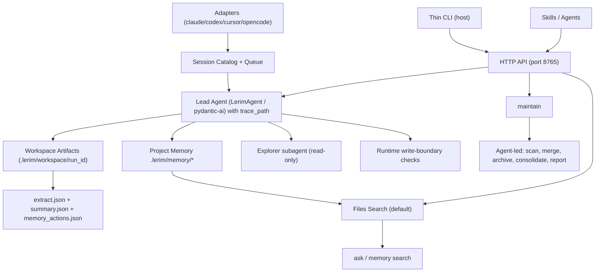

Lerim is a file-first continual learning layer that gives coding agents persistent, shared memory across sessions and platforms.

## Design principles

Lerim follows three fundamental design principles that inform all architectural decisions:

### File-first architecture

Memories are stored as plain markdown files with YAML frontmatter, not in proprietary databases. This design choice ensures that:

- Humans can read and edit memories directly in any text editor
- Agents can traverse memory using standard file operations
- Version control works naturally with git
- No database lock-in or schema migrations
- Backup and sync tools work without special adapters

```text
<repo>/.lerim/memory/
  decisions/20260301-api-auth-strategy.md
  learnings/20260301-queue-heartbeat-fix.md
  summaries/20260301/143022/implement-auth-middleware.md
```

### Primitive-first memory model

Lerim organizes knowledge into three memory primitives:

- **decisions** — explicit architectural or design choices
- **learnings** — insights, procedures, frictions, pitfalls, and preferences
- **summaries** — session narratives with user intent and outcomes

Each primitive lives in its own folder with a consistent frontmatter schema. The graph source of truth comes from explicit `id` and `slug` references in frontmatter, not from vector embeddings or proprietary indexes.

### Project-scoped memory

Memories are stored per-project in `<repo>/.lerim/` by default. This keeps context local to the codebase and prevents knowledge bleed between unrelated projects. A global fallback scope exists at `~/.lerim/` for memories outside git repositories.

<Info>
The `project_fallback_global` scope mode is configured but global fallback retrieval is not yet implemented in the runtime. Memories are currently project-only.
</Info>

## System components

### Deployment model

Lerim runs as a single process (`lerim serve`) that provides:

- Background daemon for sync and maintenance cycles
- HTTP API server on `localhost:8765`
- Dashboard web UI for session analytics and memory browsing

The service typically runs inside a Docker container via `lerim up`, but can also be started directly for development.

```bash
# Docker deployment (production)
lerim up

# Direct deployment (development)
lerim serve
```

CLI commands like `lerim ask`, `lerim sync`, and `lerim status` are thin HTTP clients that forward requests to the server.

### Architecture diagram

The system processes agent sessions through three main flows:



<Accordion title="Component responsibilities">
  <div>
    **Adapters** — Platform-specific connectors that discover and normalize sessions from Claude, Codex, Cursor, and OpenCode into JSONL format.

    **Session Catalog** — SQLite database with FTS index for session metadata and job queue state.

    **Lead Agent** — PydanticAI orchestrator with runtime tools for extraction, summarization, and memory writes.

    **Explorer Subagent** — Read-only PydanticAI agent delegated by the lead for evidence gathering.

    **DSPy Pipelines** — ChainOfThought extraction and summarization with transcript windowing.

    **Memory Store** — Markdown files in `decisions/`, `learnings/`, `summaries/` with YAML frontmatter.

    **HTTP API** — JSON REST API for CLI, skills, and dashboard communication.
  </div>
</Accordion>

## Data flow overview

### Sync flow

1. **Session discovery**: Adapters scan platform-specific session stores (JSONL files or SQLite databases)
2. **Normalization**: Sessions are exported to JSONL format in `~/.lerim/cache/`
3. **Indexing**: Session metadata is indexed in `sessions.sqlite3` with FTS for search
4. **Extraction**: Lead agent orchestrates DSPy extraction pipeline with transcript windowing
5. **Deduplication**: Explorer subagent finds existing memories; lead agent applies `add|update|no-op` policy
6. **Memory write**: Lead agent writes new/updated memories via boundary-enforced runtime tools
7. **Summarization**: DSPy summarization pipeline creates session narrative in `summaries/`

<Note>
The sync flow processes one session at a time. The lead agent receives only the `trace_path` and creates a workspace folder for all run artifacts.
</Note>

### Maintain flow

1. **Scan**: Lead agent reads all memories in the project's memory folder
2. **Merge**: Identifies and merges near-duplicate memories
3. **Archive**: Soft-deletes low-confidence or stale memories to `archived/`
4. **Consolidate**: Combines related memories into higher-level insights
5. **Decay**: Applies time-based confidence decay based on access patterns
6. **Report**: Writes `maintain_actions.json` with operation counts

Maintenance runs offline (not during agent sessions) and iterates over all registered projects.

### Query flow

The `ask` and `memory search` commands are read-only:

1. **File scan**: Default search uses `glob` and `grep` over markdown files (no index required)
2. **FTS search**: Optional full-text search via SQLite FTS virtual table
3. **Access tracking**: Reads are recorded in `memories.sqlite3` for decay calculations
4. **Response**: Lead agent (for `ask`) or direct search (for `memory search`) returns results

## Storage model

### Per-project storage

```text
<repo>/.lerim/
  config.toml              # project-specific config overrides
  memory/
    decisions/
      20260301-api-auth-strategy.md
    learnings/
      20260301-queue-heartbeat-fix.md
    summaries/
      20260301/143022/implement-auth-middleware.md
    archived/
      decisions/           # soft-deleted decisions
      learnings/           # soft-deleted learnings
  workspace/
    sync-20260301-143022-a3f9b1/
      extract.json
      summary.json
      memory_actions.json
      agent.log
      subagents.log
      session.log
    maintain-20260301-150000-c7d8e2/
      maintain_actions.json
      agent.log
      subagents.log
  index/
    memories.sqlite3     # access tracking for decay
```

### Global storage

```text
~/.lerim/
  config.toml              # user-global config
  index/
    sessions.sqlite3       # session catalog + FTS + job queue
  cache/
    cursor/               # exported Cursor sessions as JSONL
    opencode/             # exported OpenCode sessions as JSONL
  activity.log            # append-only activity log
  platforms.json          # connected platform registry
  docker-compose.yml      # generated by lerim up
```

<Tip>
All memory files use the same frontmatter schema with `id`, `title`, `created`, `updated`, `source`, `confidence`, and `tags`. No sidecars.
</Tip>

## Configuration precedence

Configuration is layered from low to high priority:

1. **Package defaults** — `src/lerim/config/default.toml` (shipped with package)
2. **User global** — `~/.lerim/config.toml`
3. **Project overrides** — `<repo>/.lerim/config.toml`
4. **Environment override** — `LERIM_CONFIG` env var path (for CI/tests)

API keys are read exclusively from environment variables:

- `ZAI_API_KEY` — primary API key
- `OPENROUTER_API_KEY` — OpenRouter key for DSPy pipelines
- `OPENAI_API_KEY` — optional OpenAI direct key
- `ANTHROPIC_API_KEY` — optional Anthropic direct key

## Security boundaries

Lerim enforces strict runtime boundaries:

- **Write boundary**: Runtime tools deny `write` and `edit` outside `memory_root` and workspace folders
- **Memory primitive enforcement**: Memory files can only be created via `write_memory` tool (Python builds frontmatter, LLM never touches YAML)
- **Read-only subagent**: Explorer subagent has only `read`, `glob`, `grep` tools (no write/edit)
- **No shell execution**: All file operations use Python tools (no subprocess)
- **Local-only HTTP**: API binds to `127.0.0.1` by default (no auth needed)

<Info>
See `runtime/tools.py` lines 142-149 for write boundary implementation.
</Info>

## Next steps

<CardGroup cols={2}>
  <Card title="Extraction pipeline" icon="filter" href="/architecture/extraction-pipeline">
    Learn how DSPy ChainOfThought extracts memories from transcripts
  </Card>
  <Card title="Agent runtime" icon="robot" href="/architecture/agent-runtime">
    Understand the PydanticAI lead agent and subagent orchestration
  </Card>
  <Card title="Adapters" icon="plug" href="/architecture/adapters">
    Explore platform-specific session adapters and normalization
  </Card>
</CardGroup>
