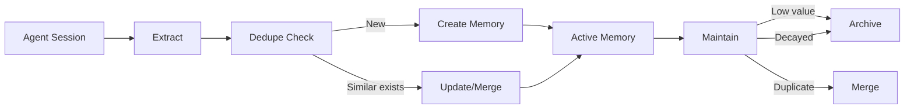

Lerim stores memories as plain markdown files with YAML frontmatter. No database required — files are the canonical store that both humans and agents can read.

## Memory primitives

Lerim uses three core memory types:

| Primitive | Purpose | Example |
|-----------|---------|--------|
| **Decision** | An architectural or design choice made during development | "Use JWT bearer tokens for API auth" |
| **Learning** | A reusable insight, procedure, friction point, or preference | "pytest fixtures must be in conftest.py for discovery" |
| **Summary** | An episodic record of what happened in a coding session | "Refactored auth module, added rate limiting" |

<Info>
Decisions and learnings are extracted automatically from agent sessions. Summaries are created for every synced session as episodic records.
</Info>

### Learning kinds

Learnings are further categorized by kind:

<AccordionGroup>
  <Accordion title="insight">
    A general observation or understanding that provides value for future work.
    
    **Example**: "React hooks must follow the rules of hooks — no conditionals, loops, or nested functions."
  </Accordion>
  
  <Accordion title="procedure">
    A step-by-step process or workflow for accomplishing a task.
    
    **Example**: "To add a new API endpoint: 1) Define route in routes.py, 2) Add handler in controllers/, 3) Write tests in tests/api/"
  </Accordion>
  
  <Accordion title="friction">
    Something that caused difficulty, slowdown, or frustration.
    
    **Example**: "Docker build takes 8 minutes on M1 Macs due to platform emulation. Use --platform linux/arm64 flag."
  </Accordion>
  
  <Accordion title="pitfall">
    A mistake or trap to avoid in the future.
    
    **Example**: "Never commit .env files — they contain production secrets. Add to .gitignore immediately."
  </Accordion>
  
  <Accordion title="preference">
    A stylistic or tooling preference, habit, or convention.
    
    **Example**: "Use single quotes for strings in Python. Auto-formatted with black --skip-string-normalization."
  </Accordion>
</AccordionGroup>

## Directory layout

### Project scope: `<repo>/.lerim/`

Each registered project stores its own memories:

```
<repo>/.lerim/
  config.toml              # project overrides
  memory/
    decisions/
      20260220-use-jwt-auth.md
      20260221-postgres-over-mysql.md
    learnings/
      20260220-pytest-fixtures.md
      20260222-docker-m1-performance.md
    summaries/
      20260222/          # date: YYYYMMDD
        153000/          # time: HHMMSS
          refactored-auth-module.md
    archived/
      decisions/
        20260101-old-decision.md
      learnings/
        20260101-outdated-learning.md
  meta/
    traces/
      sessions/
        claude/
          abc123.jsonl
        codex/
          def456.jsonl
  workspace/
    sync-20260220-120000-abc123/
      extract.json       # extracted candidates
      summary.json       # session summary
      memory_actions.json # what was written
      agent.log          # lead agent trace
      subagents.log      # explorer subagent trace
      session.log        # session processing log
    maintain-20260223-140000-xyz789/
      maintain_actions.json
      agent.log
      subagents.log
  index/
    memories.sqlite3     # access tracker for decay
```

<Note>
The `workspace/` directory contains detailed run artifacts for debugging. Each sync or maintain run gets its own timestamped folder.
</Note>

### Global scope: `~/.lerim/`

Shared across all projects:

```
~/.lerim/
  config.toml              # user configuration
  index/
    sessions.sqlite3       # session catalog, FTS, queue
  cache/
    cursor/                # exported JSONL from SQLite
    opencode/              # exported JSONL from SQLite
  activity.log            # sync/maintain history
  platforms.json          # connected platforms
  docker-compose.yml      # generated by lerim up
```

## Frontmatter schemas

All metadata lives in YAML frontmatter — no sidecars. The frontmatter schema is enforced by the `write_memory` runtime tool.

### Decision frontmatter

```yaml
---
id: dec-abc123
title: Use JWT bearer tokens for API auth
created: "2026-02-20T10:30:00Z"
updated: "2026-02-20T10:30:00Z"
source: sync
confidence: 0.85
tags:
  - auth
  - api
  - security
---

Bearer tokens with short expiry (15min) and refresh tokens (7 days).
Stored in httpOnly cookies to prevent XSS attacks. Redis for token
blacklist on logout.
```

**Required fields**:

- `id` — Unique identifier (format: `dec-{slug}` or `lrn-{slug}`)
- `title` — Short, descriptive title
- `created` — ISO 8601 timestamp of creation
- `updated` — ISO 8601 timestamp of last update
- `source` — Where the memory came from (usually `sync` or `manual`)
- `confidence` — Float from 0.0 to 1.0 representing extraction confidence
- `tags` — List of descriptive labels for categorization

### Learning frontmatter

```yaml
---
id: lrn-def456
title: pytest fixtures must be in conftest.py
created: "2026-02-21T14:00:00Z"
updated: "2026-02-21T14:00:00Z"
source: sync
confidence: 0.7
tags:
  - testing
  - pytest
kind: insight
---

Fixtures defined in test files are not discovered by other test files.
Put shared fixtures in conftest.py at the package root or in test
subdirectories. Pytest auto-discovers conftest.py in parent directories.
```

**Required fields** (all decision fields plus):

- `kind` — One of: `insight`, `procedure`, `friction`, `pitfall`, `preference`

### Summary frontmatter

```yaml
---
id: sum-ghi789
title: Refactored auth module
description: Added rate limiting and improved token validation
date: "2026-02-22"
time: "15:30:00"
coding_agent: claude
raw_trace_path: meta/traces/sessions/claude/abc123.jsonl
run_id: abc123
repo_name: my-project
created: "2026-02-22T15:45:00Z"
source: sync
tags:
  - auth
  - refactoring
---

## Session Summary

Refactored the authentication module to improve token validation logic.
Added rate limiting middleware using Redis. Fixed edge case where expired
tokens weren't properly rejected.

## Key Changes

- Implemented sliding window rate limiter (100 req/min per IP)
- Added token signature verification
- Updated tests to cover edge cases
```

**Required fields**:

- `id` — Unique identifier (format: `sum-{slug}`)
- `title` — Session title
- `description` — Brief session description
- `date` — Session date (YYYY-MM-DD)
- `time` — Session start time (HH:MM:SS)
- `coding_agent` — Platform name (`claude`, `codex`, `cursor`, `opencode`)
- `raw_trace_path` — Relative path to session JSONL file
- `run_id` — Session identifier from the agent platform
- `repo_name` — Repository name or path
- `created` — ISO 8601 timestamp
- `source` — Usually `sync`
- `tags` — List of topics/themes

<Tip>
Summaries are organized by date and time in `summaries/YYYYMMDD/HHMMSS/` for easy chronological browsing.
</Tip>

## Memory lifecycle

Memories flow through a simple lifecycle:



### 1. Create

During sync, the extraction pipeline identifies memory candidates:

- DSPy `ChainOfThought` analyzes transcript windows
- Candidates are validated for quality and confidence
- Explorer subagent checks for existing similar memories
- Lead agent writes new memory files via `write_memory` tool

### 2. Read

Query commands retrieve memories with project-first scope:

- `lerim ask "question"` — Natural language query
- `lerim memory search "keyword"` — Direct keyword search
- Project memories are searched first, global fallback is planned

### 3. Update

When similar memories exist, the lead agent decides to merge or update:

- Compare confidence scores
- Merge complementary information
- Update `updated` timestamp
- Keep the stronger memory and archive the weaker one

### 4. Archive

During maintain, low-value memories are soft-deleted:

- Moved to `memory/archived/{primitive}/`
- Not deleted permanently (can be restored manually)
- Triggered by low effective confidence or time-based decay

## Confidence and decay

Each memory has a `confidence` score (0.0 to 1.0) assigned during extraction. Over time, memories that aren't accessed lose effective confidence through decay.

### Decay calculation

```python
def effective_confidence(base_confidence, days_since_access):
    decay_period = 180  # days
    floor = 0.1
    
    if days_since_access < 30:  # grace period
        return base_confidence
    
    decay_factor = min(days_since_access / decay_period, 1.0)
    decayed = base_confidence * (1 - decay_factor)
    return max(decayed, floor)
```

### Default decay settings

- **Decay period**: 180 days
- **Confidence floor**: 0.1 (never drops below)
- **Archive threshold**: 0.2 (effective confidence below this triggers archiving)
- **Grace period**: 30 days (recently accessed memories skip decay)

<Info>
Access tracking happens automatically when memories are read via `lerim ask` or `lerim memory search`. The access timestamp and count are stored in `index/memories.sqlite3`.
</Info>

## Scope resolution

Lerim supports three memory scope modes (configured via `[memory] scope` in config):

| Scope | Read behavior | Write behavior |
|-------|---------------|----------------|
| `project_fallback_global` (default) | Read from project first, fall back to global | Write to project |
| `project_only` | Project only | Project only |
| `global_only` | Global only | Global only |

<Note>
Global memory fallback is configured but not yet fully implemented in the runtime. Memories are currently project-scoped only.
</Note>

## File naming convention

Memory files follow a consistent naming pattern:

```
{YYYYMMDD}-{slug}.md
```

- **Date prefix**: Extracted from the sync run ID or current date
- **Slug**: Generated from the title using `slugify()` — ASCII only, lowercase, hyphens for spaces

**Examples**:

- `20260220-use-jwt-auth.md`
- `20260221-pytest-fixtures.md`
- `20260222-docker-m1-performance.md`

<Tip>
The date prefix makes it easy to track when decisions and learnings were captured, and ensures unique filenames even with similar titles.
</Tip>

## Reset policy

Memory reset is explicit and destructive:

```bash
# Wipe everything (both project and global)
lerim memory reset --scope both --yes

# Project data only (keeps sessions DB)
lerim memory reset --scope project --yes

# Global data only (deletes sessions DB)
lerim memory reset --scope global --yes
```

<Warning>
The sessions database lives in global `index/`, so `--scope project` alone does not reset the session queue. Use `--scope global` or `--scope both` to fully reset.
</Warning>

After a reset, you can re-sync recent sessions:

```bash
lerim memory reset --yes
lerim sync --max-sessions 5  # re-sync newest conversations
```

## What's next?

<CardGroup cols={2}>
  <Card title="Sync and maintain" icon="rotate" href="/concepts/sync-maintain">
    Learn how memories are extracted and refined
  </Card>
  <Card title="CLI reference" icon="terminal" href="/cli/overview">
    Explore all memory commands
  </Card>
  <Card title="Configuration" icon="gear" href="/configuration/overview">
    Configure decay settings and memory scope
  </Card>
  <Card title="API reference" icon="code" href="/cli/overview">
    Use the HTTP API to query memories
  </Card>
</CardGroup>